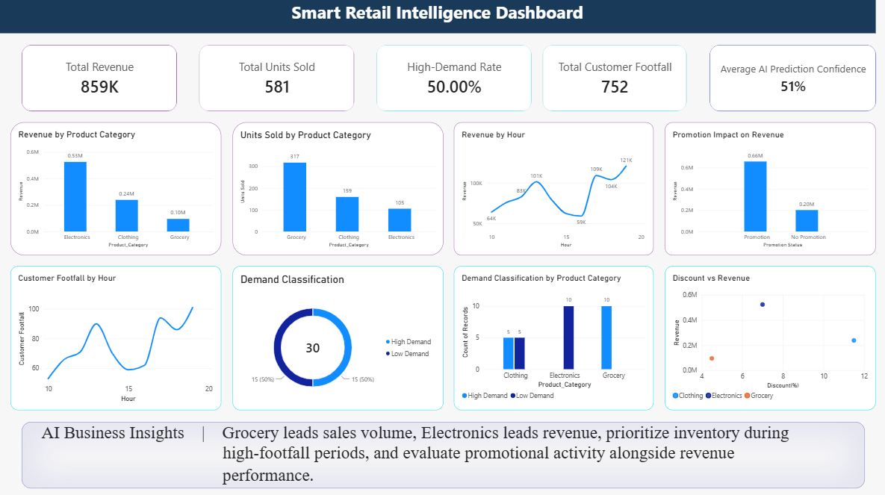

# Smart Retail Intelligence
An AI-powered retail analysis system that combines computer vision, customer footfall, sales analytics, machine learning-based demand prediction, and an interactive Power BI dashboard.

## Project Overview
Smart Retail Intelligence is an end-to-end retail analytics project designed to transform retail data into actionable business insights.

The system integrates:

- Computer vision for customer detection and tracking
- Customer footfall and entry-exit analysis
- Sales and revenue analytics
- Machine learning-based demand classification
- AI-generated business insights and recommendations
- Power BI dashboard for interactive visualization

## Key Features

### 1. Customer Detection and Tracking
Uses YOLO-based computer vision to detect and track people through a live webcam feed. 

### 2. Customer Footfall Analysis
Tracks customer entry and exit activity and calculates:
- Total entries
- Total exits
- Current customers inside
- Peak customer count
- Busiest hours

### 3. Sales Analytics
Analyzes:
- Revenue by product category
- Units sold by category
- Revenue by hour
- Customer footfall by hour
- Revenue per customer

### 4. AI Demand Prediction
A Random Forest classification model predicts whether retail demand is **High Demand** or **Low Demand** using operational and business features.

### 5. AI Business Insights
Generates automated recommendations based on demand predictions, sales performance, product categories, and peak revenue periods.

### 6. Interactive Power BI Dashboard
Presents KPIs, sales trends, demand classification, promotion analysis, and AI insights in an interactive dashboard.

## Technology Stack

- **Python** — Core programming and data processing
- **YOLO (Ultralytics)** — Object detection and customer tracking
- **OpenCV** — Real-time webcam video processing
- **Pandas** — Data cleaning and analysis
- **NumPy** — Numerical data processing
- **Scikit-learn** — Machine learning model development
- **Joblib** — Model saving and loading
- **Matplotlib** — Data visualization
- **Power BI** — Interactive business intelligence dashboard
- **CSV** — Data storage and exchange

## Project Structure

```text
Smart-Retail-Intelligence/
│
├── src/
│   ├── test_yolo.py
│   ├── live_detection.py
│   ├── customer_counter.py
│   ├── footfall_analysis.py
│   ├── retail_analytics.py
│   ├── ml_model.py
│   ├── predict_demand.py
│   ├── ai_business_insights.py
│   ├── ai_report.py
│   └── create_dashboard_data.py
│
├── outputs/
│   ├── retail_demand_model.pkl
│   ├── demand_confusion_matrix.png
│   ├── demand_feature_importance.png
│   ├── demand_feature_importance.csv
│   ├── ai_business_insights.txt
│   └── ai_report.csv
│
├── customer_data.csv
├── customer_sales.csv
├── ml_training_data.csv
├── dashboard_data.csv
├── yolo11n.pt
├── Smart_Retail_Intelligence_Dashboard.pbix
└── README.md
```
## Data Sources

The project uses multiple datasets for different analytical components:

- `customer_data.csv` — Customer entry and exit records generated by the computer vision tracking system.
- `customer_sales.csv` — Sample retail sales data containing date, hour, product category, units sold, and revenue.
- `ml_training_data.csv` — Training dataset containing sales, customer footfall, discount, promotion, and product information for demand prediction.
- `dashboard_data.csv` — Model-enhanced dataset prepared for Power BI, including AI demand classification and prediction probability.

## Machine Learning

The project uses a Random Forest classification model to predict retail demand.

### Target Variable

`High_Demand` is defined based on `Units_Sold` using the median sales volume as the threshold.

- Units sold above or equal to the threshold → High Demand
- Units sold below the threshold → Low Demand

### Model Features

The model uses:

- Hour
- Product Category
- Customer Footfall
- Discount
- Promotion

`Units_Sold` is not used as an input feature to avoid target leakage.

### Model Evaluation

The dataset was divided into training and testing sets using an 80/20 split with stratification.

The current model achieved **100% accuracy on the 6-row test set**. Because the dataset is small and synthetic, this result should not be interpreted as evidence of production-level model performance.

## AI Business Insights

The AI business insights engine combines demand predictions with sales performance data to generate practical retail recommendations.

The system analyzes:

- Total revenue
- Total units sold
- Highest-revenue product category
- Best-selling product category by units
- Peak revenue hour
- Predicted demand status

Example insights generated by the system include:

- Maintaining appropriate inventory levels based on predicted demand
- Prioritizing high-revenue product categories
- Monitoring inventory for high-volume product categories
- Planning promotional activities around high-revenue periods

## Power BI Dashboard

The project includes an interactive Power BI dashboard for monitoring retail performance and AI-driven demand insights.

### Key Performance Indicators

- Total Revenue
- Total Units Sold
- Total Customer Footfall
- High-Demand Rate
- Average AI Prediction Confidence

### Dashboard Visualizations

- Revenue by Product Category
- Units Sold by Product Category
- Revenue by Hour
- Customer Footfall by Hour
- Demand Classification
- Demand Classification by Product Category
- Promotion Impact on Revenue
- Discount vs Revenue
- AI Business Insights

The dashboard is saved as:

`Smart_Retail_Intelligence_Dashboard.pbix`

## How to Run

### 1. Activate the Virtual Environment

```bash
.venv\Scripts\activate

### 2. Install Required Libraries

```bash
pip install pandas numpy scikit-learn joblib matplotlib opencv-python ultralytics
```

### 3. Run Computer Vision

```bash
python src\test_yolo.py

For live detection:

```bash
python src\live_detection.py
```

For customer counting:

```bash
python src\customer_counter.py
```

### 4. Run Machine Learning

```bash
python src\ml_model.py
```

### 5. Generate Demand Predictions

```bash
python src\predict_demand.py
```

### 6. Generate AI Insights and Reports

```bash
python src\ai_business_insights.py
```

```bash
python src\ai_report.py
```

### 7. Generate Power BI Data

```bash
python src\create_dashboard_data.py
```

The generated `dashboard_data.csv` is used as the data source for the Power BI dashboard.

## Project Outputs

The project generates the following outputs:

- `customer_data.csv` — Customer entry and exit records
- `dashboard_data.csv` — Data prepared for the Power BI dashboard
- `retail_demand_model.pkl` — Trained machine learning model
- `demand_confusion_matrix.png` — Model evaluation visualization
- `demand_feature_importance.png` — Feature importance visualization
- `demand_feature_importance.csv` — Feature importance data
- `ai_business_insights.txt` — AI-generated business recommendations
- `ai_report.csv` — AI business report

## Limitations

- The machine learning dataset is relatively small and synthetic.
- The current model achieved 100% accuracy on a 6-row test set, so the result should not be treated as production-level performance.
- Real-world deployment would require a larger dataset collected across different dates, customer patterns, products, promotions, and store conditions.
- Customer counting performance may vary depending on camera angle, lighting, occlusion, and customer movement.
- AI-generated recommendations are based on the available project data and should be treated as decision-support insights rather than guaranteed business outcomes.

## Future Improvements

- Expand the dataset with real-world retail data collected over a longer period.
- Improve demand prediction using additional historical sales and customer behavior features.
- Integrate real-time customer footfall data with sales transactions.
- Experiment with additional machine learning algorithms and model validation techniques.
- Improve customer tracking under crowded conditions and varying camera angles.
- Add automated alerts for high-demand products and low-inventory situations.
- Deploy the system as a web-based retail analytics application.

## Conclusion

Smart Retail Intelligence demonstrates how computer vision, data analytics, machine learning, AI-generated insights, and business intelligence can be combined into a single retail analytics solution.

The project transforms customer, sales, and operational data into meaningful insights that can support inventory planning, demand analysis, sales monitoring, and retail decision-making.

## Author

**Dhruvi Solanki**

IMBA Student | Business Analytics & AI Enthusiast

## Dashboard Preview

